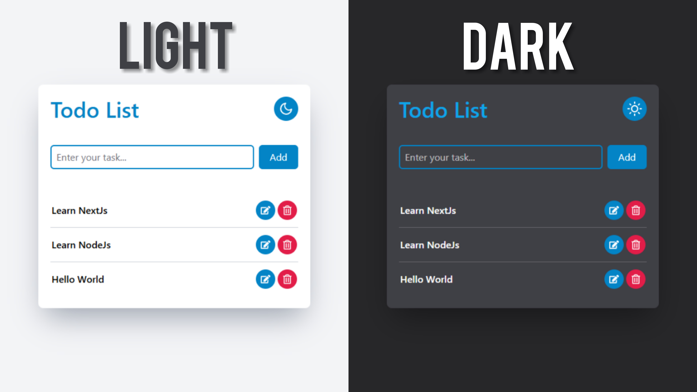

# React + Vite + TS

### See [Demo](https://hadiheidariazar.github.io/todo-list-app/)

## Getting Started
First, run the development server
```bash
npm run dev
# or
yarn dev
```

Second, run the TailwindCss compiler
```bash
npm run tailwind
# or
yarn tailwind
```

Now, open [http://localhost:5173](http://localhost:5173/) with your browser to see the result

## Developed with


### Made with ❤ by Hadi Heidariazar